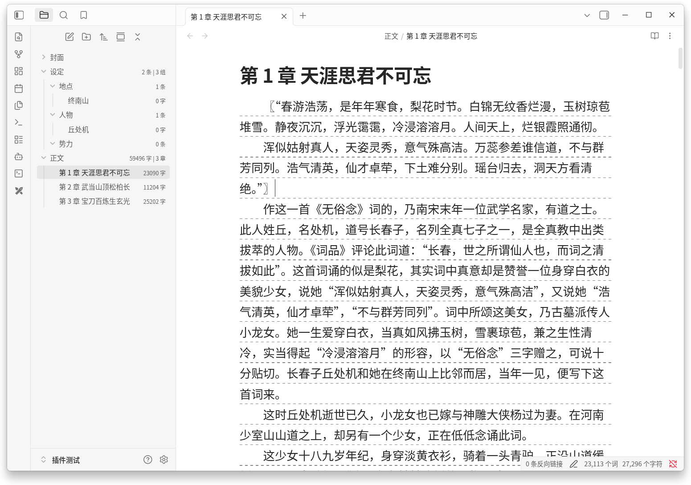

# Novelists Assistant

**English** | [简体中文](docs/README_zh-CN.md)

Enhance your novel writing experience with various writing tools to keep complex storylines organized.

## Features

### Default directory structure

- One-click creation of the `Lore` and `Novel` folders (localized: `设定`/`正文` in Chinese UI) with settings auto-pointed to them
- Folders that already exist are detected on startup and linked automatically

### Novel typesetting

- First-line indent and line height for files in the novel folder, in both source and reading (preview) view
- Reading view has an independent toggle and parameters; soft line breaks render as independently indented lines

### Grid lines

- Dashed grid lines under each line of novel files in source view, like manuscript paper
- Dash length, gap, thickness, and opacity are all configurable

### Quick menu

- **New chapter** (file menu): creates the next chapter in the novel folder with auto-incrementing numbers, supporting digits, Chinese lowercase, and Chinese uppercase, then opens it in the current tab
- **Add to lore** (editor menu): turns the selected text into a lore note inside a chosen lore subfolder
- **Sync lore links** / **Clear lore links** (editor menu): wrap or unwrap every lore name in the current note as wikilinks in one click
- **Chapter conversion** (settings): rename existing chapters between numbering formats

### Word count (file explorer)

- Per-file word count shown next to each file — markdown syntax is stripped before counting; CJK characters count individually, Latin letters and digits count as words
- Folder stats: the lore folder shows total lore notes and groups, the novel folder shows total words and chapters, and each lore subfolder shows its note count
- All units are configurable and can be hidden

## Installation

### Community plugins (recommended)

1. In Obsidian, open **Settings → Community plugins**
2. Turn off **Restricted mode**
3. Click **Browse**, search for "Novelists Assistant", and install

### Manual

1. From [latest release](https://github.com/AlfredClark/obsidian-novelists-assistant/releases) download `main.js`, `manifest.json`, and `styles.css` directly
2. Place the files into `Vault/.obsidian/plugins/novelists-assistant/`

## Settings

All features are grouped in the settings tab and can be toggled independently. The interface language follows your Obsidian language (English, Simplified Chinese, Traditional Chinese) and can be overridden.

## Compatibility

- Obsidian 1.13.1 or higher
- Desktop only

## License

This project is licensed under GPL-3.0-only — see [LICENSE](LICENSE).
